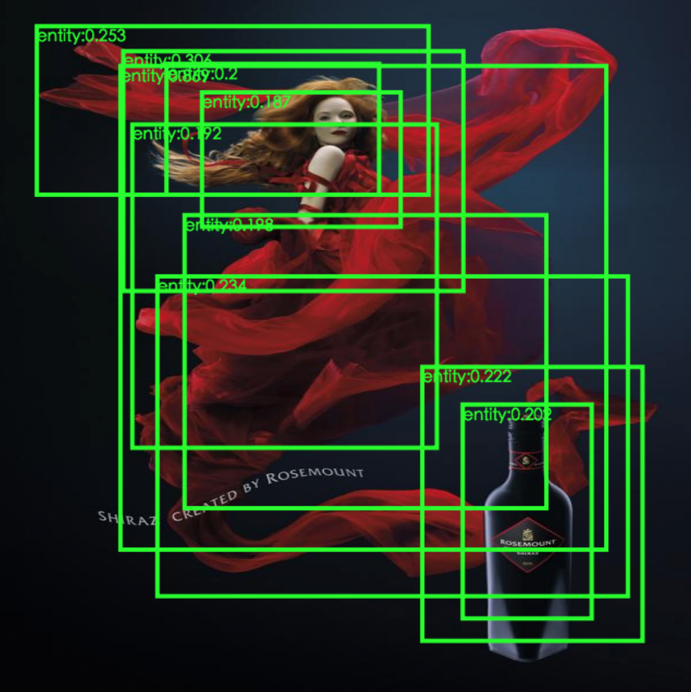
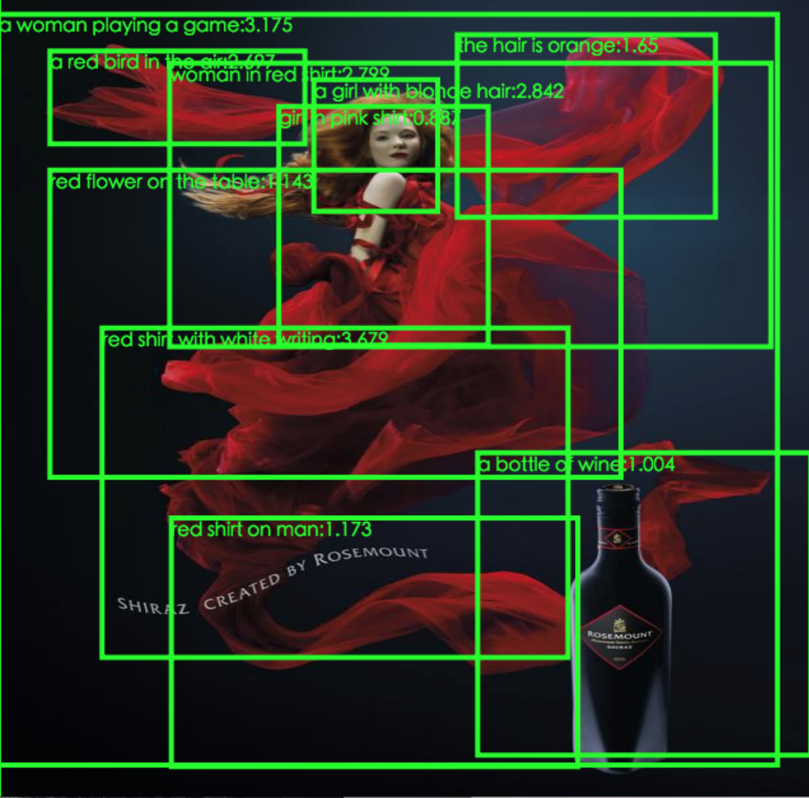
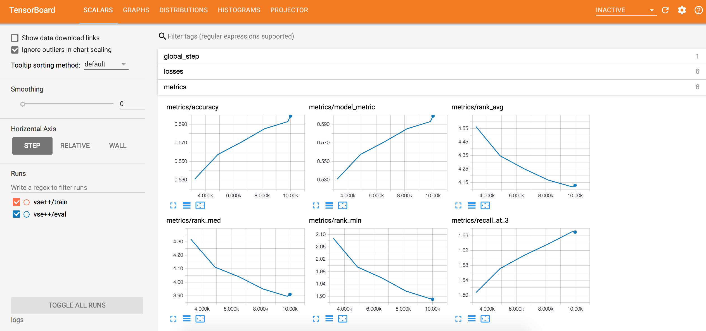

# ADVISE: Symbolism and External Knowledge for Decoding Advertisements.

The ADVISE project focuses on the embedding learning task of PITT ads dataset
(see [LINK](http://people.cs.pitt.edu/~kovashka/ads/)). We also use this
implementation to take part in the Automatic Understanding of Visual
Advertisements challenge (see 
[LINK](https://evalai.cloudcv.org/web/challenges/challenge-page/86/overview)). 
As the baseline approaches, the <a href="configs/vse++.pbtxt">VSE</a> model
achieves an accuracy of 62% and the <a href="configs/advise.kb.pbtxt">ADVISE</a>
model achieves an accuracy of 69% in the challenge.

In general, our model utilizes triplet ranking loss to distinguish between 
related caption-image pair and unrelated caption-image pair caption-image pair. 
By doing so, the model project both image patches and words into a shared 
vector space, which could be later used for tasks such as classification, 
captioning, vision question answering and so on. Beyond the traditional visual
semantic embedding, we found that using the 1) bottom-up attention mechanism, 2)
constraints via symbols and captions, 3) additive external knowledge, helps to
improve the final performance especially for the public service announcements 
(PSAs).

We provide both the baseline <a href="configs/vse++.pbtxt">VSE</a> model and 
our <a href="configs/advise.kb.pbtxt">ADVISE</a> model in this repository.
If you are using our implementation, please cite our paper:
```
Ye, Keren, and Adriana Kovashka. "ADVISE: Symbolism and External Knowledge for
Decoding Advertisements." arXiv preprint arXiv:1711.06666 (2017).
```
\[[link](https://arxiv.org/pdf/1711.06666.pdf)\]\[[bibtex](https://scholar.googleusercontent.com/scholar.bib?q=info:K2QWc_pL9-YJ:scholar.google.com/&output=citation&scisig=AAGBfm0AAAAAWvsX4yeW9FRFUealOfUsxcfTEzOL2F4A&scisf=4&ct=citation&cd=-1&hl=en)\]

## Prerequisites
Tensorflow >= version 1.6

Disk space > 20G (in order to store the downloaded images and intermediate files)

## Getting start

* Clone this repository.
```
git clone https://github.com/yekeren/ADVISE.git
```

* Enter the ROOT of the local directory.
```
cd ADVISE
```

* Prepare the PITT Ads Dataset and pre-trained models. This step shall take 
a long time to proceed (3-4 hours in our enviroments using GPU). The 
"prepare\_data.sh" script shall guide you to to:

      - Download the PITT Ads Dataset (>= 11G)
      - Clone the "tensorflow/models" repository, in which we use the
      object\_detection API and the InceptionV4 slim model.
      - Download the pre-trained GloVe model.
      - Download the pre-traind InceptionV4 model.
      - Prepare the vocabulary and initial embedding matrix of the action-reason 
      annotations of the ads data.
      - Prepare the vocabulary and initial embedding matrix of the DenseCap
      annotations.
      - Prepare the vocabulary and initial embedding matrix of the ads symbols.
      - Extract both the image features and the regional features using
      InceptionV4 model. Note that we provide two types of region proposals. 
      <a href="output/symbol_box_test.json">One</a> extracted using the tensorflow
      object detection API (we trained the model on ads symbol boxes by ourselves), 
      and <a href="output/densecap_test.json">the other</a> extracted using the 
      DenseCap model. You could also provide region proposals extracted by 
      yourselves and encode them using the same JSON format. Note: it is not 
      necessary to extract features using both of the two region proposals. 
      So you can comment out either the symbol box or the densecap box 
      ("prepare_data.sh" line 144-166).


```
sh prepare_data.sh
```

* If you want to provide region proposals extracted by yourselves. You can 
still use the visualization tools provided by us:
```
cd visualization/data
ln -s ../../output/densecap_test.json .
ln -s ../../output/symbol_box_test.json .
ln -s ../../data/test_images/ ./images
cd ..
python -m SimpleHTTPServer 8009
```
Then checkout the contents from your web browswer
using <a href="http://localhost:8009/symbol_box.html">http://localhost:8009/symbol_box.html</a>
or <a href="http://localhost:8009/densecap_box.html">http://localhost:8009/densecap_box.html</a>.
You shall see results similar to:




* After executing the "prepare_data.sh", you could check the md5 of all the
generated files. Go back to the ROOT directory, then process the following
command. The md5sum of the text file or the JSON file should be matched exactly.
For the numpy file in binary format, they may differ.
```
-bash-4.2$ md5sum output/*
36d0aad26211f30354e090aaa47d4091  output/action_reason_vocab.txt
ed0acc8ec59417570eea441409447161  output/action_reason_vocab_200d.npy
fc8f76661974da9da38d0129e32e743b  output/action_reason_vocab_200d.txt
7a80cd63e7e5b5a1694e9ace4510b375  output/densecap_roi_features_test.npy
06ee2292ff5d7c8cd3123fe8dc2d6e98  output/densecap_roi_features_train.npy
e71d5ee025555c7023fd649960f788b3  output/densecap_test.json
0c5eca4e60ede2d8747e65a4b11865be  output/densecap_train.json
d8e28f23ced3b6fe28f6e62f650ff126  output/densecap_vocab.txt
b4d91bdcf1e1ae6b7da0f9835273e745  output/densecap_vocab_200d.npy
aaf569fa4aae865dce0573cd2ec2714a  output/densecap_vocab_200d.txt
61834cf3b3789fe56c8742d457e66818  output/img_features_test.npy
44fc423c6c4408f9dac4224b0c1a0ad0  output/img_features_train.npy
ffda0d73098391eeac856331dec0cf9f  output/roi_features_test.npy
89ba7436bbc00469825bcb7e5168d9cc  output/roi_features_train.npy
e1e274f66de34a7e2848a823d8a9a7cd  output/symbol_box_test.json
55149b62b1c8a60c28b7f79f2a4595c9  output/symbol_box_train.json
9736646352537f6b46d1c8aa2405113a  output/symbol_test.json
a47b142e4924546ad5fd0867c544ad60  output/symbol_train.json
2a9fe9bdf5ac9b71143db5fd30284bd1  output/symbol_vocab.txt
e19a978cb9234f55b14e1dbb44fcbd2a  output/symbol_vocab_200d.npy
ec781897fa8d585773e2cc4cf81e6a64  output/symbol_vocab_200d.txt
```

## Training and evaluation
The last thing that one need to do before training the model is to compile the
protobuf files. Go to the ROOT directory of ADVISE repository and execute:
```
protoc protos/*.proto --python_out=.
```
To train the toy VSE model, one can simply execute:
```
sh train.sh
```
The tensorflow program shall generate human-readable log in the directory of
"log" and tensorboard log in the directory of "logs". To monitor the training
process, one simply use the tensorboard command:
```
tensorboard --logdir logs --port 8001
```
Then open <a href="http://127.0.0.1:8001">http://127.0.0.1:8001</a> in the web 
browser to see the training progress. The final results (JSON format) will be
stored in the directory "saved_results".




## Results
We now report our experimental results on our held-out validation set (10,000 
images from the training set).

| Method        | Config file     | Accuracy | RankMin  |  RankAvg  | RankMed  |
| ------------- |:---------------:| --------:| --------:|  --------:| --------:|
| VSE++         | vse++.pbtxt     | 0.6660   | 1.734    |  3.858    | 3.614    |
| ADVISE        | advise.kb.pbtxt | 0.7284   | 1.554    |  3.552    | 3.311    |

This VSE++ model achieves a score of 0.62 in the challenge, and the ADVISE model
achieves a score of 0.69 in the challenge.


## References
Finally, special thanks to these authors, our implementation mainly depends 
on their efforts.
```
Hussain, Zaeem, et al. "Automatic understanding of image and video
advertisements." 2017 IEEE Conference on Computer Vision and Pattern Recognition
(CVPR). IEEE, 2017.

Kiros, Ryan, Ruslan Salakhutdinov, and Richard S. Zemel. "Unifying
visual-semantic embeddings with multimodal neural language models." arXiv
preprint arXiv:1411.2539 (2014).

Faghri, Fartash, et al. "VSE++: Improved Visual-Semantic Embeddings." arXiv
preprint arXiv:1707.05612 (2017).

Huang, Jonathan, et al. "Speed/accuracy trade-offs for modern convolutional
object detectors." IEEE CVPR. 2017.

Anderson, Peter, et al. "Bottom-up and top-down attention for image captioning
and VQA." arXiv preprint arXiv:1707.07998 (2017).

Teney, Damien, et al. "Tips and Tricks for Visual Question Answering: Learnings
from the 2017 Challenge." arXiv preprint arXiv:1708.02711 (2017).

Johnson, Justin, Andrej Karpathy, and Li Fei-Fei. "Densecap: Fully convolutional
localization networks for dense captioning." IEEE CVPR. 2016.

Schroff, Florian, Dmitry Kalenichenko, and James Philbin. "Facenet: A unified
embedding for face recognition and clustering." IEEE CVPR. 2015.

Szegedy, Christian, et al. "Inception-v4, inception-resnet and the impact of
residual connections on learning." AAAI. Vol. 4. 2017.

Abadi, Martín, et al. "TensorFlow: A System for Large-Scale Machine Learning."
OSDI. Vol. 16. 2016.
```
